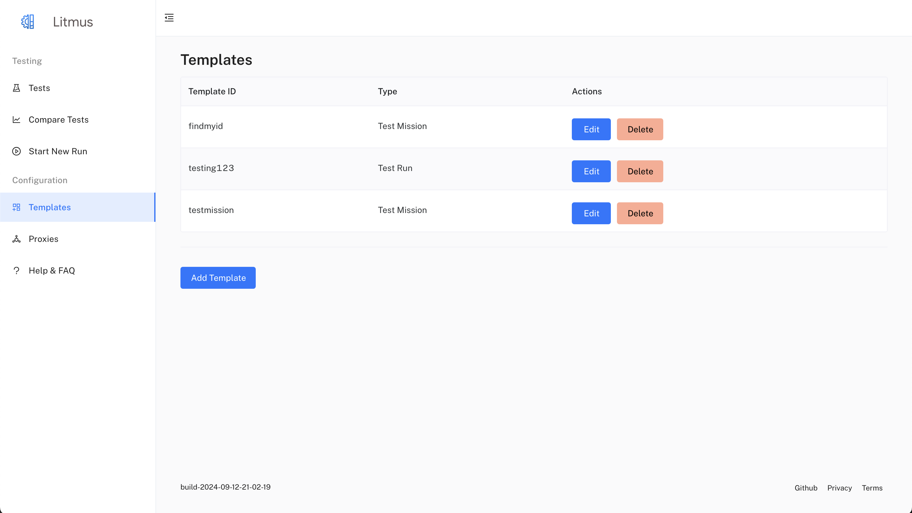

# Adding Templates

This document outlines the steps to add a new test template using the Litmus User Interface (UI). Litmus supports two types of templates:

- **Test Run:** For evaluating individual requests against expected responses, optionally with LLM-based assessment.
- **Test Mission:** For evaluating multi-turn conversations guided by an LLM, where the LLM generates requests based on a mission description and previous interactions.


## Prerequisites

- Litmus deployed to Google Cloud, accessible through the web interface. See the main [Litmus README](https://github.com/google/litmus/blob/main/README.md) for deployment instructions.

## Steps

1. **Navigate to the Templates Page:** After logging into Litmus, click on "Templates" in the left-hand navigation menu.



2. **Open the Add Template Form:** Click the "Add Template" button. This will open a new form for creating a test template.


3. **Provide Template Details:**

   - **Template ID:** Enter a unique name to identify your template (e.g., "search-query-template").
   - **Template Type:** Select either "Test Run" or "Test Mission" from the dropdown.
   - **Test Cases/Mission Items:**
     - For **Test Runs:**
       - Click on "Add Test Case" to add individual test data items.
       - For each test case, provide:
         - **Query:** The input to your LLM (e.g., "What is the capital of France?").
         - **Response:** The expected output or golden answer from your LLM (e.g., "Paris").
         - **Filter** (optional): Any additional filters you want to apply (comma-separated).
         - **Source** (optional): A source identifier for the test case.
         - **Block** (optional): Toggle whether this test case should be blocked.
         - **Category** (optional): A category to organize your test cases.
     - For **Test Missions:**
       - Click on "Add Mission" to add a mission item.
       - For each mission item, provide:
         - **Mission:** A description of the overall mission or task the LLM should accomplish. This description will guide the LLM's actions throughout the interaction loops.
         - **Mission Result:** The expected outcome or goal of the mission. This will be used by the LLM for evaluation after the mission is complete.
         - You can still optionally provide Filter, Source, Block, and Category as for Test Runs.
   - **Request Payload:**
     
     - Use the JSON editor to define the structure of your test request.
     - Include placeholders (e.g., `{query}`) for dynamic values from your test cases or missions. For "Test Missions", the {query} placeholder will be dynamically replaced with the LLM's generated requests in each turn.
   - **Pre-Request and Post-Request (optional):** Use the JSON editor to define optional requests to be executed before and after the main test request. These apply to both Test Runs and Test Missions.
   - **LLM Evaluation Prompt (optional):**
     - For **Test Runs:** Provide a prompt to guide the LLM in assessing similarity between actual responses and golden responses for individual test cases.
     - For **Test Missions:** Provide a prompt to guide the LLM in evaluating the overall success of the mission based on the mission description, conversation history, and expected outcome.
   - **Input and Output Field Selection:**
     
     - Click on the "Input Field" button. The left-hand pane will display a JSON representation of your "Request Payload." Click the node corresponding to the field you wish to use as input to your test cases or missions.
     - You can run your "Request Payload" to get an example response by clicking the "Test Request" button.
     - After running your request, click on the "Output Field" button. In the left-hand pane, click the node corresponding to the field you wish to use as the output for assessment.
   - **Mission Duration (for Test Missions only):** Enter the number of interaction loops the LLM should perform to accomplish the mission.

4. **Test Your Request:** (Optional) Before saving, you can test the "Request Payload" by clicking the "Test Request" button. This ensures the request is valid and helps you visualize the response. This is useful for both Test Runs and Test Missions.

5. **Save the Template:** When finished, click the "Add Template" button. This will save your new template.

6. **Start a Run:** You can now use this template to submit test runs. Refer to the [Submitting Test Runs](/ui-start-test-run) documentation for details.

## Example JSON Upload

You can also populate test cases by uploading a JSON file. The JSON file must have an array with the following structure:

**For Test Runs:**

```json
[
  {
    "query": "What is the capital of France?",
    "response": "Paris",
    "filter": "location,city",
    "source": "wikipedia",
    "block": "false",
    "category": "geography"
  },
  {
    "query": "What is the highest mountain in the world?",
    "response": "Mount Everest",
    "filter": "mountain,height",
    "source": "nationalgeographic",
    "block": "false",
    "category": "geography"
  }
]
```

**For Test Missions:**

```json
[
  {
    "query": "Book a flight from San Francisco to New York for two adults on December 20th, returning on December 25th.",
    "response": "Okay, I have booked your flight from San Francisco to New York for December 20th to 25th. Can I help you with anything else?",
    "filter": "travel, flights",
    "source": "example",
    "block": "false",
    "category": "booking"
  }
]
```

To upload your JSON:

- Go to the "Test Cases" or "Missions" tab, depending on your template type.
- Click the "Upload JSON" button.
- Select your JSON file.

Litmus will validate the file and populate the test cases or missions.
